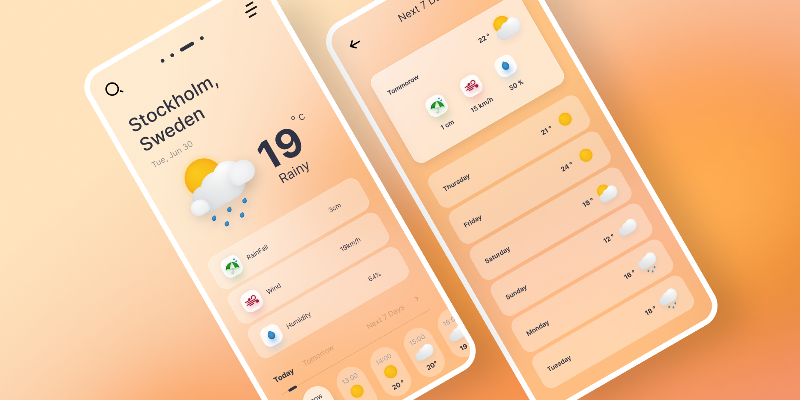
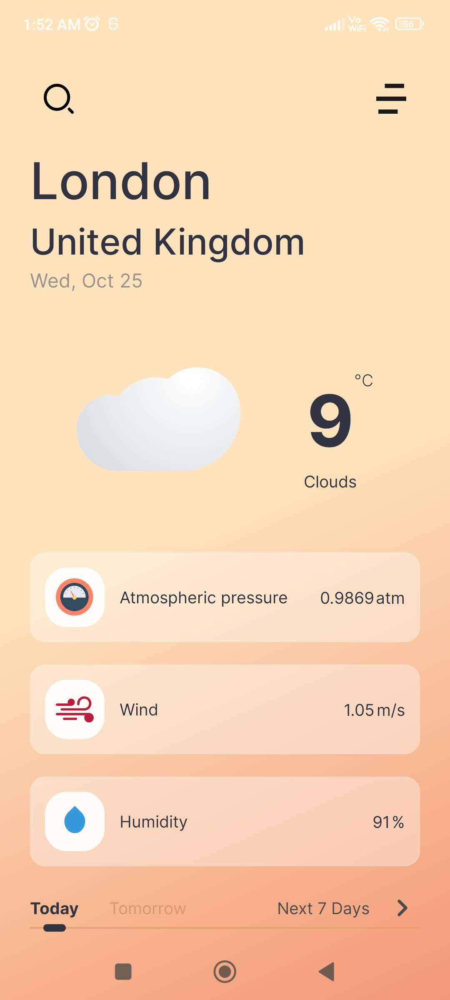
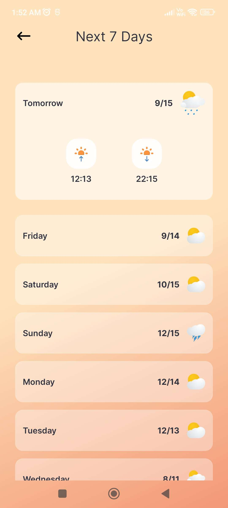

# Weathernaut

**Requirements**
- Android Studio latest version
- JDK 8
- Android SDK 33
- Supports API Level +24
- Material Components 1.10.0

**Highlights**
- Use [OpenWeatherMap] & [Open-Meteo] API
- Use Material Design 2
- Responsive UI
- Background Lofi Music
- Use locale Database

**Screenshot**

   

    
   

